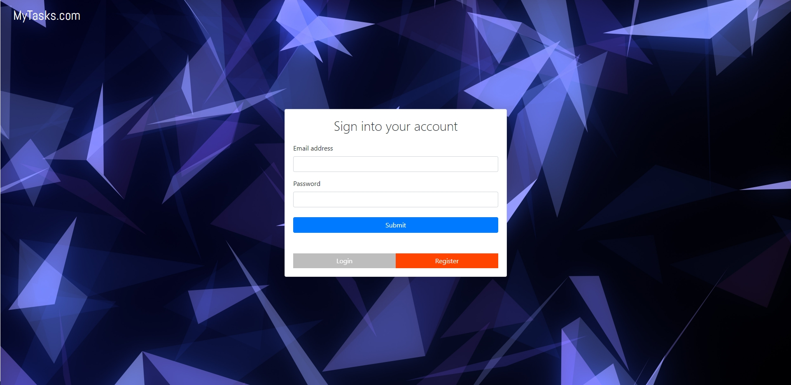
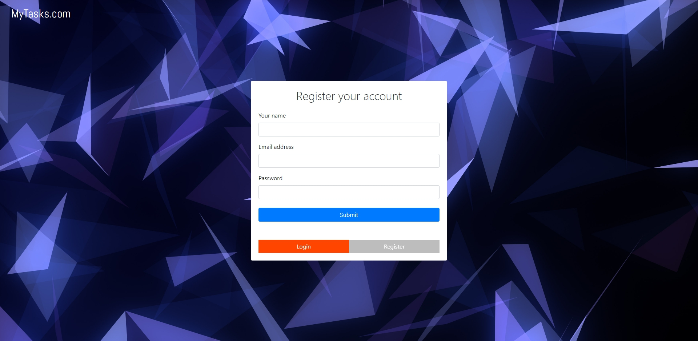
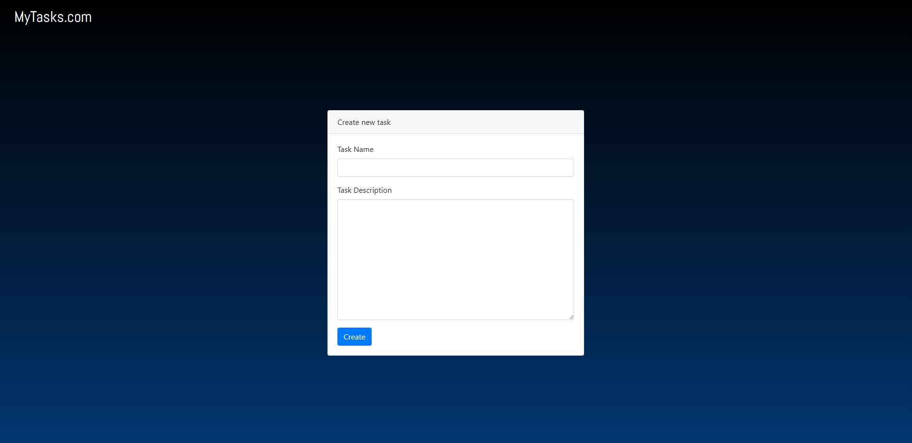
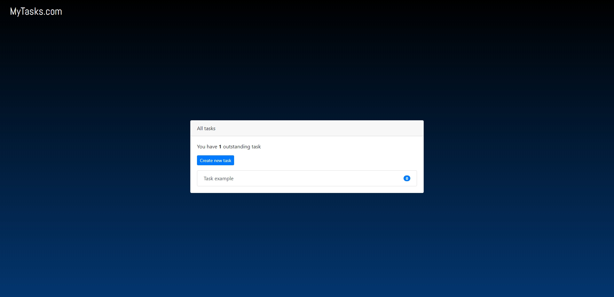
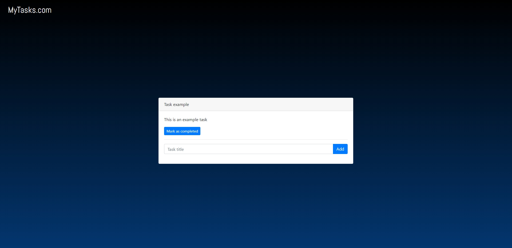

## MyTasks Project

+

## Built using React JS & Laravel

Getting started with React JS & Laravel:

- **[React](https://reactjs.org/)**
- **[Node](https://nodejs.org/en/)**
- **[Laravel](https://laravel.com/)**
- **[Composer](https://getcomposer.org/)**

## Screenshots

Sign in

Create an account

Create a new task

Task list

Complete a task

